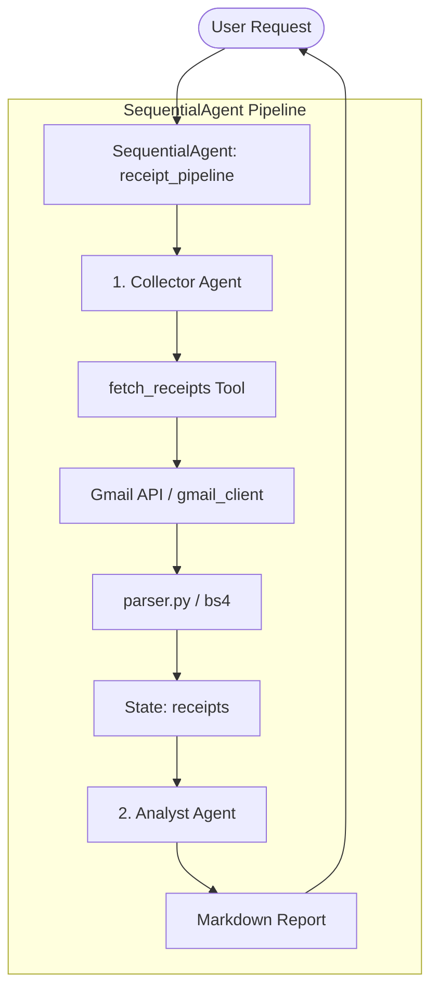

# Gmail Purchase Receipt Spending Analyzer

A multi-agent system built using the Google ADK (Agent Development Kit) framework to pull purchase receipts from Gmail, parse them deterministically, and analyze spending patterns.

## Core Capstone Concepts

1. **Multi-Agent Design (SequentialAgent)**: Uses a structured pipeline where `collector_agent` gathers receipt data and stores it in the shared context, and `analyst_agent` generates spending insights from it.
2. **Custom Function Tools**: Uses standard python functions decorated with type hints and docstrings. Data is shared between agents using the ADK `ToolContext` state.
3. **Gmail Read-Only Security**: Uses the strict `https://www.googleapis.com/auth/gmail.readonly` scope, ensuring the agent cannot modify or send emails.

## Architecture Diagram



## Setup Steps

1. **Google Cloud Console Setup**:
   - Create a Google Cloud Project.
   - Enable the **Gmail API**.
   - Configure the OAuth Consent Screen (add test users if in desktop sandbox mode).
   - Create credentials of type **OAuth client ID** (Application type: **Desktop app**).
   - Download the client credentials JSON and save it as `credentials.json` in the root directory.

2. **API Keys & Configuration**:
   - Obtain a Gemini API Key from [Google AI Studio](https://aistudio.google.com/apikey).
   - Copy `.env.example` to `.env` and fill in `GOOGLE_API_KEY`:
     ```bash
     cp .env.example .env
     ```

3. **Install Dependencies**:
   - Use Python 3.10+. Install the package requirements:
     ```bash
     pip install -r requirements.txt
     ```

## How to Run

You can run and interact with the pipeline in two ways:

* **ADK Web Interface (Interactive UI)**:
  ```bash
  adk web
  ```
  Navigate to the local URL displayed in the terminal and select `receipt_pipeline`.

* **CLI Execution**:
  ```bash
  adk run receipt_agent
  ```
